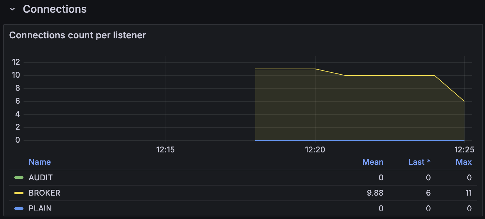

# Kafka Audit Logs Demo

Demonstrates how to use Confluent audit logs to identify which client IDs interact with the cluster through a specific listener.

The broker exposes two client-facing listeners:

| Listener | Port  | Auth        | Purpose                        |
|----------|-------|-------------|--------------------------------|
| PLAIN    | 29092 | None        | Unauthenticated (detect usage) |
| AUDIT    | 9094  | SASL/PLAIN  | Authenticated                  |

Audit log routing is configured to capture all produce/consume events on user topics into dedicated audit log topics (internal and audit topics are excluded to reduce noise).

## Setup

The audit log routing config lives in `security-event-router-config.json`. To update it:

```sh
cat security-event-router-config.json | jq -c . | pbcopy
```

Paste the output into `KAFKA_CONFLUENT_SECURITY_EVENT_ROUTER_CONFIG` in `compose.yaml`.

## Python Environment

```sh
python3 -m venv venv
source venv/bin/activate
pip install -r requirements.txt
```

## Run the Demo

```sh
# Start the cluster
docker compose up -d

# Create a test topic
kafka-topics --bootstrap-server localhost:29092 --create --topic foobar
```

### Producers

In separate terminals (activate the venv in each):

```sh
# Producer A — sends to the PLAIN listener (no auth, port 29092)
python producer_plain.py

# Producer B — sends to the AUDIT listener (SASL/PLAIN, port 9094)
python producer_secured.py
```

### Consumers

```sh
# Consumer A — reads from foobar via the PLAIN listener (no auth, port 29092)
python consumer_plain.py

# Consumer B — reads from foobar via the AUDIT listener (SASL/PLAIN, port 9094)
python consumer_secured.py
```

### Audit Log Consumer

```sh
# Consumes audit-log events and prints a summary of each
python consumer_audit.py
```

The audit consumer reads from `confluent-audit-log-events-allowed-topic-produce` and prints the listener, client ID, principal, timestamp, subject, and method for each event.

### Grafana Metrics

Check the dashboard Kafka cluster dashboard to see if there are enough connections count per listener.


